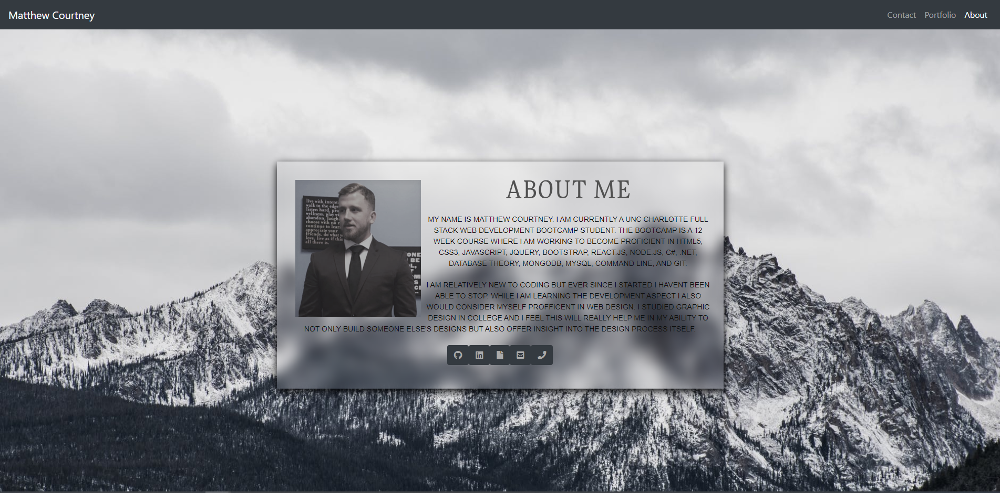

# React Portfolio
 #  

This portfolio was built using react. I kept all the styling the same from my previous portfolio. 

 ## Table of Contents
 * [Technologies Used](#Technologies Used)
 * [License](#License)
 * [Visuals](#Visuals)
 * [Links](#Links)

## Technologies Used
    * React
    * Bootstrap
    * react-router-dom

 ## License
 [MIT]  This project is covered by the MIT license

  ## Visuals
  

  ## Links
   * [GitHub](https://github.com/sharkattack182/react-portfolio)
   * [Deployed](https://serene-sea-06734.herokuapp.com/)
